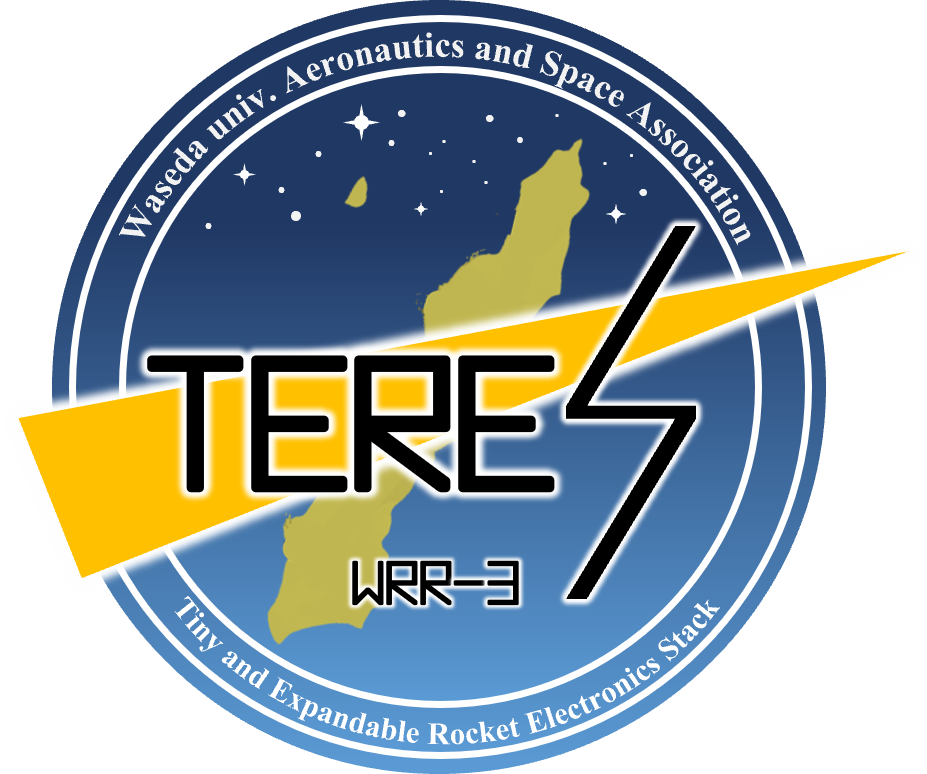

# Tiny & Extendable Rocket Electronics Stack

モデルロケットに搭載可能な，小型かつ拡張可能な電装



[テレメトリ・コマンド運用](https://wasa-rockoon.github.io/TERES/)


# 要求

- 内径40mmのボディに収まること
- 水密を確保できること
- ミッションや開発状況に応じて組み替え・拡張可能であること


# 仕様

- モジュール式
- マイコン：主にRP2040

## 外形

各モジュールは円盤状で，これを積み重ねて固定した上でロケットのボディ部またはノーズ部に搭載できる．

- 基板外径：36mm
- 基板間コネクタ：2.54mmピッチ ピンヘッダ・ピンソケット
- 固定：M2プラスチックスペーサーx4

## バス

上下のモジュールとUARTで通信し，デイジーチェーンで全体にわたるバスを形成する．

1. GND
2. UART TX
3. V+ (3.6V ~ 6V)
4. UART RX
5. GND

[通信プロトコル](https://github.com/wasa-rockoon/WCCP)

## モジュール

### LiPo電源

- 電源スイッチ
- 外部電源入力
- LiPo充電コントローラ
- LiPo温度センサ
- LiPoヒータ
- ハイサイド電流センサ

### GNSS

- GNSS受信モジュール
- バックアップ用充電池


### センサー

- 9軸センサ
- 気圧センサ
- 外部温度センサ

### テレメトリ

- TWELITE (2.4GHz)
- LoRaモジュール (920MHz)

### ロガー

- MicroSDカード
- Flash
- RTC
- バックアップ用充電池


### カメラ

- ESP32
- カメラモジュール
- マイク

## 詳細設定

### テレメトリ項目・サンプリングコード

1. ダウンリンク(10 Hz)
- GNSS
- LiPo電池残量・温度
- 気圧データ
- 9軸センサの値(姿勢を可視化するプログラムを作れたら)

2. SDカード
- 外部温度センサ(10 Hz)
- 9軸センサの値(姿勢を可視化するプログラムを作れなかったら)(10 Hz)
- カメラ映像
- マイク

### 動作モード

1. 待機フェーズ(重力加速度のみ)
2. 上昇フェーズ(垂直方向加速度>0になってから規定時間 or 気圧低下中)
3. 下降フェーズ(発射から規定時間経過後 or 気圧上昇中)
- パラシュート展開成功(垂直方向加速度==0)
- 弾道落下(ABS(垂直方向加速度)==10)
4. 着陸後フェーズ(気圧変動なし & ABS(加速度ベクトル)==10)


# ビルド

## Arduino

Arduino のライブラリディレクトリに，`software/Library/`のシンボリックリンク（またはコピー）を追加する．


# 使い方
## 動画を生成する
```
python script/make_movie.py "<連番画像フォルダのパス>"
```
